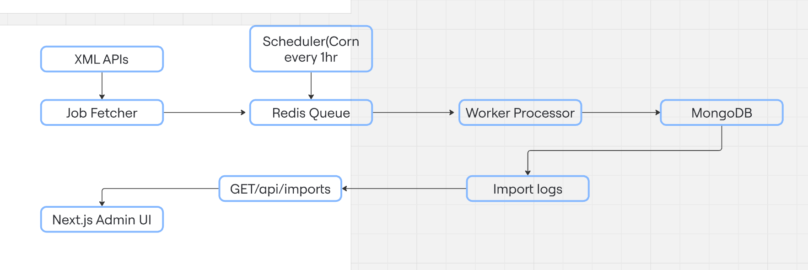

#  System Architecture – JobImporter

---

##  Overview

The system fetches jobs from real-time XML feeds, converts them to JSON, queues them for background processing, and stores/upserts them in MongoDB. A UI provides import history visibility.

---

##  Components

| Component        | Purpose                                     |
|------------------|---------------------------------------------|
| Job Fetcher      | Fetch XML feeds and convert to JSON         |
| Redis Queue      | Manage background processing                |
| Worker Processor | Insert/Update jobs and log status           |
| Scheduler        | Runs fetcher every 1 hour via cron          |
| Import Logger    | Saves import stats to MongoDB               |
| Admin UI         | Displays import logs using Next.js          |

---

##  Flow Diagram (Text View)

---

##  Components

| Component         | Responsibility                                               |
|------------------|---------------------------------------------------------------|
| `jobFetcher.js`  | Fetch XML feeds, parse to JSON, queue jobs                    |
| `queue.js`       | Bull queue instance with retry/backoff                        |
| `jobProcessor.js`| Worker: upserts job & logs results                            |
| `jobService.js`  | Business logic: upsert, log generation                        |
| `ImportLog`      | Tracks new/updated/failed counts for every run                |
| `index.js (UI)`  | Frontend to display logs and pagination                       |

---

##  CRON Scheduler

- `scheduler.js` runs every hour using `node-cron`
- Calls `jobFetcher.js` to enqueue jobs regularly

---

##  Retry & Backoff

- Bull queue is configured with:
  - `attempts: 3`
  - `backoff: 5000ms`
- Failed jobs are logged with reason in `failures[]`

---

##  MongoDB Collections

- `jobs` — stores job data (upserted by jobId)
- `importlogs` - stores importlogs data

## ✅ Completed Requirements

- ✅ Real API integration
- ✅ XML to JSON conversion
- ✅ MongoDB storage (with upsert)
- ✅ Redis Queue + Worker
- ✅ CRON every hour
- ✅ Import History logs
- ✅ Admin UI to view logs
